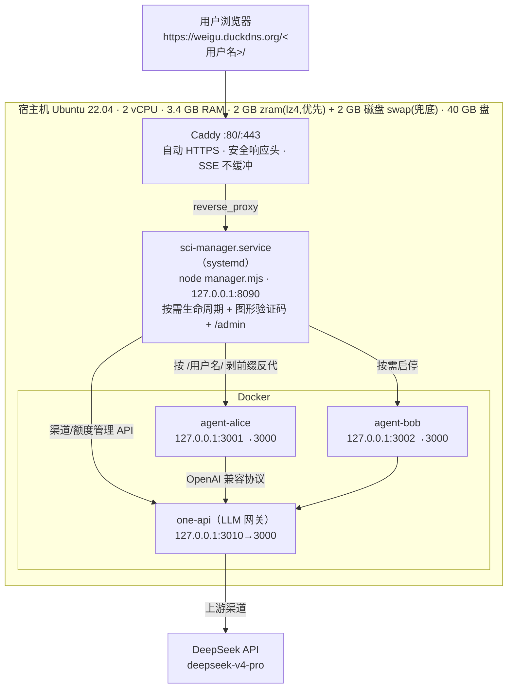

# 服务器架构（生产实况）

> 本文按 **2026-07-17 服务器实测**写成，不是设计稿——每条都来自线上 `systemctl` / `docker` / `/etc/cron.d` 的实际输出。


## 一、整体拓扑



**一句话**：Caddy 收 HTTPS → manager 按路径认人、按需拉起该用户的容器 → 容器里跑 OpenCode + 科研技能套件 → 模型调用统一走 one-api 网关出去。

## 二、请求怎么走完一趟（逐跳）

1. **浏览器** → `https://weigu.duckdns.org/alice/`
2. **Caddy**（`/etc/caddy/Caddyfile`）：自动签发/续期证书；打安全头（HSTS、`X-Content-Type-Options`、`Referrer-Policy`、`X-Frame-Options`、去掉 `Server`）；`request_body max_size 100MB`（限制上传体积）；`encode zstd gzip`；**`flush_interval -1`**——关键，关掉响应缓冲，否则模型的流式输出会被攒住不吐。全量反代到 `127.0.0.1:8090`。
3. **manager**（`deploy/manager.mjs`，systemd 单元 `sci-manager.service`）：
   - 取路径第一段当用户名；`/` 根路径返回**带图形验证码的登录门户**；`/admin` 是管理台。
   - `POST /<用户名>/api/login` 被 manager **拦下先校验验证码**（`verifyCaptcha` 不过直接 401，压根不转进容器）。
   - 该用户容器没在跑 → 当场 `docker start`，等健康检查通过再放行请求（`START_TIMEOUT_MS=60000`）。
   - 剥掉 `/<用户名>` 前缀，把剩余路径转给容器的回环端口。
4. **用户容器**（`web/server.mjs`）：校验签名 cookie → 转给容器内的 OpenCode（`OC_URL=http://127.0.0.1:4098`）→ OpenCode 按 `AGENTS.md` 路由到技能。
5. **模型调用**：容器 → `one-api`（`OC_GATEWAY_URL`）→ 上游 DeepSeek。

## 三、各组件

### Caddy
唯一对公网开放的东西（`:80`、`:443`）。**其余一切只监听 `127.0.0.1`**——manager、各用户容器、one-api 全部回环，外网打不到。

### sci-manager.service
| 参数 | 生产值 | 含义 |
|---|---|---|
| `LISTEN` | `127.0.0.1:8090` | 只收 Caddy 来的流量 |
| `WARM_CAP` | **5** | 最多 5 个容器同时在跑；要起第 6 个先按 LRU 停掉一个空闲的。**这是 3.4 GB 小内存机扛住多用户的关键闸** |
| `IDLE_MS` | `600000`（10 分钟） | 空闲这么久就自动停容器省内存 |
| `START_TIMEOUT_MS` | `60000` | 冷启动等待上限 |
| `CAP_WAIT_MS` | `120000` | 满员时排队等位上限 |
| `Restart` | `on-failure` / 3s | 崩了自动拉起 |

> `WARM_CAP=5` 的依据是实测（见第七节），不是拍的。**注意排查姿势**：`systemctl cat` 只显示单元文件，而 drop-in（`admin.conf`）里的值会盖过它——查生效值请用 `systemctl show sci-manager -p Environment`。
> （历史：单元文件与仓库模板一度写着 2、靠 drop-in 覆盖成 5，`systemctl cat` 看到的是 2，极易误判；2026-07-17 已把三处对齐成 5。）

**机密存放**：历史上放在 `/etc/systemd/system/sci-manager.service.d/admin.conf`（drop-in）里，含 `ADMIN_PASSWORD`、`ONEAPI_URL`、`ONEAPI_TOKEN`。仅 root 可读，**不入 git**。

> ⚠ **现在有两个地方可能定义这些变量，优先级要搞清楚**（2026-07-19 起）：
> `setup.sh` 会安装 `/etc/sci-manager.env` 并在单元里以 `EnvironmentFile=` 引用它。systemd 的解析顺序是
> **主单元 → drop-in**，后者胜出，所以：**drop-in > /etc/sci-manager.env > 单元里的 `Environment=`**。
> 也就是说这台机器只要还留着上面那个 drop-in，改 `/etc/sci-manager.env` 就**不会生效**（且不报错）。
> 查最终生效值：`systemctl show sci-manager -p Environment`；
> 想统一到 env 文件管理，就把 drop-in 里对应的行删掉。`setup.sh` 现在会在检测到 drop-in 时打印提醒。

### 用户容器
由 `deploy/scripts/render-compose.sh` 依据 `users/*.env` + `tiers.env` **自动生成** `docker-compose.yml`（文件头写着"勿手改"）。每用户一份：

```yaml
agent-alice:
  image: sci-agent:latest
  environment:
    OC_MODEL: "deepseek/deepseek-v4-pro"   # 由档位决定
    LAN_USER / LAN_PASSWORD / BASE_PATH: "/alice"
    USER_TIER: "admin"
    DAILY_COST_LIMIT / STORAGE_LIMIT_MB    # 由档位决定，0=不限
  volumes: [alice-uploads, alice-outputs, alice-ocdata]
  ports: ["127.0.0.1:3001:3000"]           # 只发布到回环
  restart: "no"                            # 生命周期归 manager 管，不让 docker 自动重启
  mem_limit: 1400m
  cpus: 1.5
```

> ⚠️ **`docker restart` 不会重载 compose 里的环境变量**。改了档位/env 必须**重建容器**（`docker rm -f` + `docker compose up --no-start`），否则改了等于没改。

### one-api（LLM 网关）
`justsong/one-api:latest`，`127.0.0.1:3010→3000`，数据在 `one-api-data` 卷。作用：**档位 → 模型**的路由层，以及将来多家模型 API 的灵活调度。改 `tiers.env` 里某档的模型名，该档所有用户即路由到别的渠道，容器代码零改动。

> 历史：原选型 new-api（rc.21）加渠道 API 会 panic，已弃用改 one-api。镜像 `calciumion/new-api`（325 MB）**仍残留在盘上，可清**。

## 四、数据与卷

| 卷 | 挂载点 | 内容 |
|---|---|---|
| `<用户>-uploads` | `/app/uploads` | 用户上传的原始文件 |
| `<用户>-outputs` | `/app/outputs` | 产出（论文、图、PDF） |
| `<用户>-ocdata` | `/root/.local/share/opencode` | 会话历史 `opencode.db`、日志、密码 override |
| `one-api-data` | 网关容器内 | 渠道/额度配置 |

共 7 个卷（2 用户 × 3 + 网关 1）。**用户间完全隔离**：卷不共享、容器不共享、cookie 的 `Path=/用户名/` 保证 alice 的登录票据根本不会发往 bob 的路径。

## 五、认证与隔离

- **两道登录**：manager 根门户（普通用户）和 `/admin`（管理台），**都有自建 SVG 图形验证码**（3 分钟一次性，零成本、不依赖外部服务）。
- **无状态签名 cookie**，5 天免登录。签名密钥 = **当前有效密码**的 HMAC，所以改密码后旧 cookie 全部立即失效。做成无状态是因为容器会空闲自停、内存里的 token 会丢——重启后仍认得旧 cookie。
- **改密码**：容器内 `/api/password` 写 override 到 ocdata 卷（`auth-override.json`），重启不丢。
- **审计日志**：manager 记录登录、封禁、改档等，`/admin` 里按**东八区**展示。
- **封禁**：`/admin` 一键 suspend。

## 六、档位与额度

`deploy/tiers.env`（四列：档位名 / 每日 USD / 存储 MB / 模型名，`0` = 不限）：

| 档位 | 每日 USD | 存储 MB | 模型 | 当前用户 |
|---|---|---|---|---|
| `free` | 0.30 | 1024 | deepseek-v4-pro | bob |
| `plus` | 1.50 | 4096 | deepseek-v4-pro | — |
| `admin` | 不限 | 不限 | deepseek-v4-pro | alice |

- 计量口径是 **OpenCode 的 `session.cost`（USD，已含 DeepSeek 缓存折扣）**，不是裸 token 数；跨日自动清零；持久化在 ocdata 卷。
- **跑单中途也会封顶**：事件循环盯 `message.updated` 累加本轮成本，超限当场中止，不会等这轮跑完才发现超支。
- 单价由 `OC_COST_INPUT/OUTPUT/CACHE_READ` 注入（当前 0.27 / 1.10 / 0.07 每百万 token）。
  > 坑：走网关后 OpenCode 拿不到定价 → `session.cost` 恒为 0 → 额度形同虚设。故必须把 `cost` 显式注入 provider 配置，已修。

## 七、容量（实测，非估算）

| 项 | 实测值 |
|---|---|
| 空载基线 | 462 MB |
| 每容器 | ~261 MB（空闲） |
| 单人 md→PDF | 3.9 s |
| **5 人同时 md→PDF** | **各 11 s（慢 2.8 倍），5/5 成功** |
| 5 并发时内存峰值 | 2668 MB / 3495 MB，**swap 零使用、零 OOM** |

**结论**：当前 2C3.4G + `WARM_CAP=5` 能稳住 4-5 人同时干重活。**要真正支撑 10 人并发，需升到 4C8G**——瓶颈是 CPU（2 核跑 5 个 xelatex）和内存，不是模型 API 并发。

## 八、运维

### 部署流程（改代码上线）
```
本地 push → origin(github)
  → 服务器 cd ~/sci-agent && git pull
  → 改了 Dockerfile？ deploy/scripts/build-image.sh   （重建镜像）
  → 改了 users/tiers？ deploy/scripts/render-compose.sh
  → 重建容器（不是 restart！）
```

### 定时任务（在 `/etc/cron.d/`，不在 root crontab——别只看 `crontab -l`）
| 文件 | 频率 | 干什么 |
|---|---|---|
| `sci-backup` | 每天 3:30 | `backup.sh` → `/var/backups/sci/<日期>/`：各用户卷 + one-api-data + 配置；**保留 7 天**（当前占用仅 492 KB） |
| `sci-monitor` | 每 5 分钟 | `monitor.sh`：磁盘/内存/容器健康 + 网关健康（①②每 30 分钟、③每小时，靠分钟数取模分流） |

### 管理脚本（`deploy/scripts/`）
`user-add.sh` / `user-del.sh` / `user-list.sh` / `user-tier.sh`（改档位）/ `build-image.sh` / `render-compose.sh` / `gateway-up.sh` / `backup.sh` / `monitor.sh`

## 九、镜像 `sci-agent:latest`（3.97 GB）

| 层面 | 内容 |
|---|---|
| 运行时 | node（网关 `web/server.mjs`）+ OpenCode + python3 |
| 排版 | pandoc + texlive-xetex + `texlive-lang-chinese`/`lang-cjk` + lmodern + fonts-texgyre + fontconfig |
| 技能 | `COPY deploy/skills/ → /app/.opencode/skills/`（**21 个 SKILL.md**），主控指令 `/app/AGENTS.md` |
| 内部端口 | 网关 3000、OpenCode 4098 |

> 仓库里 `.opencode/skills/` 与 `deploy/skills/` 是**双镜像**，只有 `deploy/skills/` 会进镜像；改技能要两边同步。
