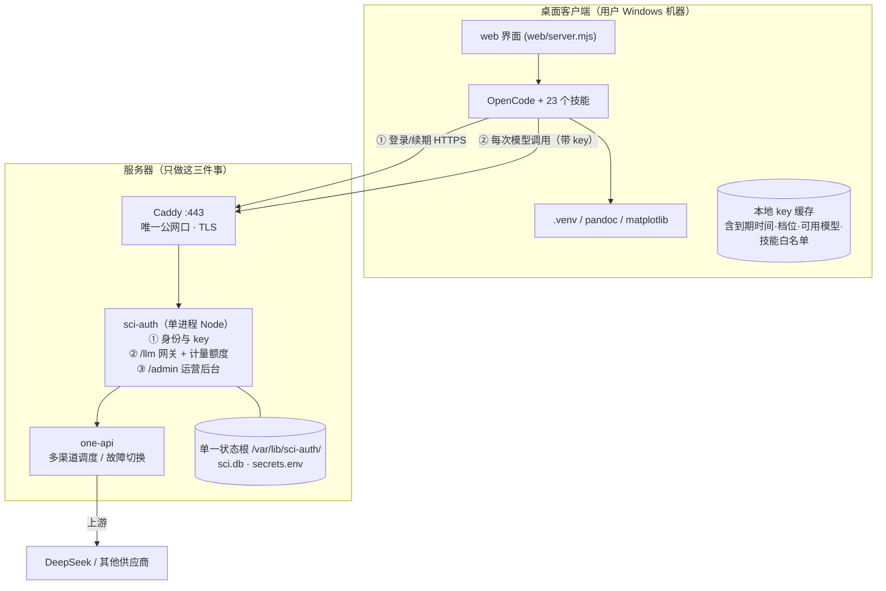

# 改造方案：服务器从「整机跑 Agent」改为「只做鉴权 + 网关」

> 2026-07-28 · 承接《需求文档-桌面本地部署-交付IT团队》§3.2–§3.5
> 现状基线：`deploy/服务器架构.md`（2026-07-17 实测）；单体版已冻结为 tag `prod-monolith-20260728` + 冷存档 `D:\backups\sci-agent-fullserver-20260728\`

---

## 0. 一句话

算力和数据下沉到桌面客户端，服务器只留三件事：**认人（身份与 key）、放行（LLM 网关 + 计量额度）、管人（运营后台）**。用户的会话、文件、产物不再进服务器。

## 1. 为什么值得改

| | 现在（单体） | 改造后（鉴权+网关） |
|---|---|---|
| 服务器职责 | Caddy + manager + 每用户一个容器 + one-api | Caddy + auth/网关单进程 + one-api |
| 单用户成本 | ~261 MB 内存常驻上限、卷占盘（lifei 已 150 MB） | 一行数据库记录 |
| 容量天花板 | 2C3.4G 实测 `WARM_CAP=5`，10 人要升 4C8G | 千级用户单机绰绰有余（只转发不算） |
| 用户数据 | 全在服务器（隐私与合规压力最大的部分） | 不落服务器，只存身份/档位/用量 |
| 重活（xelatex/LibreOffice） | 服务器扛，5 人并发慢 2.8 倍 | 客户端各扛各的，天然并行 |
| 状态散落 | **4 处**：docker 卷 + `deploy/users/*.env` + `deploy/data/quota/` + `/etc/*`（今天做迁移就是被这条坑到，见 §6） | **1 处**：单一状态根 |

改造的真正收益不是省钱，是**把最贵、最难扩、合规风险最高的部分（跑任务 + 存数据）从服务器上拿掉**，服务器退化成一个几乎不会成为瓶颈的小服务。

## 2. 目标架构



**一句话**：客户端拿 key 调 `/llm/*`，服务器认 key → 查档位与额度 → 强制改写模型 → 转给 one-api → 解析响应里的 usage 入账 → 超限就拒。

### 2.1 服务器不再有什么

删掉：每用户容器、per-user Docker 卷、`render-compose.sh`、按需唤醒生命周期（`ensureUp`/`makeRoom`/`WARM_CAP`/`IDLE_MS`/`waitReady`）、Caddy→容器的路径路由、`sci-agent:latest` 镜像（4.7 GB，只在客户端安装包里存在）。

保留但改造：Caddy、one-api、`manager.mjs` 里非容器的那一半（见 §4）。

## 3. 关键设计决策（含取舍，别跳过）

### 3.1 计量必须在服务端做，绝不能信客户端上报 🔴

现在的额度记账是**容器把 `session.cost` 上报**给宿主 `:8091/report`。容器还算半可信（我们建的镜像、跑在我们机器上）。**桌面客户端完全在用户手里**——同一套做法等于让用户自己申报消费额，额度形同虚设。

**做法**：
- 所有模型调用**必须**经 `/llm/*` 转发；**上游 key 绝不下发到客户端**（一旦下发，计量、吊销、渠道切换三件事同时失效）。
- 服务端解析上游响应里的 `usage` 入账。流式调用必须由服务端注入 `stream_options.include_usage=true`，否则最后一个 chunk 没有 usage、这一单就白记。
- 单价表在服务端（沿用现有 `OC_COST_INPUT/OUTPUT/CACHE_READ` 口径），不由客户端传。
- 请求里的 `model` 字段**不可信**：服务端按档位强制映射，客户端写什么都覆盖掉。这同时满足需求 §3.3「换模型/供应商切换对客户端透明」。

> 现有 `/llm` 转发端点（`manager.mjs:1079` 起）已经是这个形状——按用户令牌鉴权、恒时比对、转发上游。要补的只有「解析 usage 入账」和「请求前预检额度」两步。

### 3.2 key 的形状：短期票 + 服务端 epoch 吊销

需求 §3.2 只要求「停用/调档在**下一次登录**生效」，但按下面做几乎零成本就能做到**立即生效**：

- 下发 **access key**（TTL 短，建议 24h）+ **refresh token**（TTL 长，建议 30 天）。客户端在有效期内免登录，临近到期静默续期（对应验收 A4）。
- 每个用户一个 `key_epoch` 整数。**改档 / 停用 / 调额 / 重置 key → `key_epoch++`**，已签发的 access key 立刻作废。
- 网关每次请求都读一次用户行（本来就要读额度），顺带比对 epoch——不额外增加成本。
- 客户端收到 `401 KEY_REVOKED` / `403 QUOTA_EXCEEDED` / `403 SUSPENDED` 等**结构化错误码**，给友好提示而不是裸报错（需求 §3.2 明确要求）。

### 3.3 技能白名单：诚实地承认这是软管控 ⚠️

需求 §3.2.1 要「不同档位可用的 skill 模块不同、可配置」。现有 `manager.mjs` 已实现每用户模块 + 技能白名单（`MODULE_TABLE`、`skillTable()`、`/admin/api/skills`），改成**按档位配置**即可复用。

但要写清边界：**桌面版的技能在客户端执行，服务器管不到**。技能明文随安装包分发（需求 §3.8 已明确不做强 IP 保护）。所以：
- key 里带 `allowed_skills`，客户端据此渲染菜单——这挡的是**普通用户**，挡不住动手改客户端的人。
- 唯一的**硬**管控点是 LLM 通道：客户端调用时带 `X-Skill: <id>`，服务端记录并按档位校验，不合规就拒。绕过 `X-Skill` 的人仍能用技能，但**烧的是自己的额度**，且行为落在审计里。
- 结论：**分级的商业价值靠「额度 + 模型档次 + 可吊销」兜底，不靠技能隔离**。方案里不要向客户承诺「低档用户技术上无法使用高档技能」。

### 3.4 单一状态根

服务器上**所有**可变状态收敛到一个目录：

```
/var/lib/sci-auth/
├── sci.db            # SQLite：users / tiers / usage_daily / audit / announcements
├── secrets.env       # ADMIN_PASSWORD · JWT_SECRET · SMS_KEY · LLM_UPSTREAM_KEY · ONEAPI_TOKEN
└── backups/          # 本地热备快照
```

外加 **one-api-data** 一个 Docker 卷（渠道配置）。其余（Caddyfile、systemd 单元、fail2ban）全部**从仓库模板生成**，不算状态。

这条是今天迁移演练最大的教训（§6）：状态散落几处，备份脚本就一定会漏掉其中一处。

### 3.5 数据库选型

SQLite 足够：写入量是「每次 LLM 调用一行 usage」，千级用户日均几万行。用 WAL 模式 + `sqlite3 .backup` 热备。**不要**为了「显得正规」上 Postgres——那会把单一状态根重新拆成两半，迁移复杂度立刻回到今天的样子。真到需要时再迁不迟。

## 4. 复用 `manager.mjs` 而不是重写

现有 `deploy/manager.mjs`（1194 行）里，**目标架构要的东西已经写好一大半**：

| 已有能力 | 位置 | 改造后 |
|---|---|---|
| `/llm/*` 转发 + 每用户令牌恒时比对 | `:1079-1130` | ✅ 留，补 usage 入账 + 额度预检 |
| 额度账本（读/加/今日成本/跨日清零） | `:655-680` | ✅ 留，落库代替 json 文件 |
| 档位表（每日 USD / 存储 / 模型） | `tiers.env`、`:588-642` | ✅ 留，加"可用技能"列 |
| 每用户模块 + 技能白名单 | `:603-641`、`/admin/api/{modules,skills}` | ✅ 留，改成按档位配 |
| `/admin` 运营后台（用户列表/改档/停用/加删/用量/审计） | `:723-982` | ✅ 留，去掉容器相关按钮 |
| one-api 管理 API 接入（渠道/模型） | `:44-62`、`/admin/api/gateway/*` | ✅ 留 |
| 图形验证码 + 签名 cookie + 审计日志 + fail2ban 联动 | `:78-158` | ✅ 留，cookie 逻辑复用到 key 签发 |
| 按需容器生命周期、反代、排队 | `:196-460` | ❌ 删（约 300 行） |

**要新写的只有三块**：手机号+短信验证码注册登录、key 签发/续期/吊销、usage 解析入账。重写等于把「`session.cost` 恒为 0 导致额度失效」「验证码防爆破」「fail2ban 认 401 不认 400」这些踩过的坑再踩一遍。

> 建议改名 `sci-auth.mjs` 并搬到 `server/`，因为它不再"manage"任何容器。

## 5. 一键迁移方案（新架构）

### 5.1 为什么会变得简单

要带走的东西从「10 个卷 + 4 处配置 + 一个 4.7 GB 镜像」缩成：

1. `/var/lib/sci-auth/`（一个目录）
2. `one-api-data` 卷（一个卷）
3. 代码（git tag）

镜像不用带了——服务器侧只有 node + one-api 官方镜像，没有自建的 4.7 GB 大镜像。

### 5.2 脚本设计（`ops/migrate-export.sh` / `ops/migrate-import.sh`）

把今天验证出来的经验直接固化进去：

**必须做到的七条**

1. **入 git 时就是 `100755`**。今天 `export-all.sh`/`import-all.sh` 是 `100644`，新机 `./import-all.sh` 直接 Permission denied——恰恰是恢复链的入口。CI 加一条 `git ls-files -s ops/*.sh | grep -v 100755 && exit 1`。
2. **一个包装全部**，不再分「卷包 + 宿主包」。今天正是因为 `export-all.sh` 只管 compose 内的东西，`/etc/sci-manager.env`（含 `ADMIN_PASSWORD`）要靠人记得手工搬——记不住就永久丢失。
3. **SQLite 用 `.backup` 热备**，不 tar 活文件。可以不停服导出，也不会拿到半个 WAL。
4. **包内自带 MANIFEST + 每个成员的 sha256**，导入时**先校验再动数据**（今天验证过：坏包在清空目标之前就中止）。
5. **导入先移到 `.rollback` 再解包，失败原样还回去**；且**绝不无条件删 `.rollback`**（上次中断时数据的唯一副本可能就在里面）。这三条今天都实测通过了，直接照抄。
6. **密钥单独一层并加密**。今天的包里 `.env`/`users/*.env`/`sci-manager.env` 全是明文密码，只能靠"别放进 git、别用 IM 传"的纪律兜着。新包把 `secrets.env` 用 `age` 加密成独立成员，主包可以随便放。
7. **导入后自检**：起服务 → `GET /healthz` → 用一个内置测试账号跑一次登录 → 打一次 `/llm` 冒烟 → 打印结论。不自检的导入等于"看起来成功了"。

**最有价值的一条：导出后自动做影子恢复演练**

```
migrate-export.sh
  → 生成包
  → 在同机把包恢复到临时目录 + 临时端口，起一个影子实例
  → 打 /healthz + 登录冒烟
  → 通过才把包标成 OK，否则响亮失败并退非零
```

今天我是**手工**做的这件事（还原到影子卷、`diff -r`、`integrity_check`、四个失败用例）。固化成脚本后，每天的自动备份都自带"这个包真的能恢复"的证明——**备份不再是一个没验过的希望**。

### 5.3 日常备份

```
每天 3:30  migrate-export.sh → /var/backups/sci-auth/<日期>/  （保留 7 天）
         └─ 自动影子恢复演练，失败则告警（复用现有 sci-monitor 的企微 webhook）
每天 4:00  rsync 到异地
```
新架构的包会非常小（千级用户的 sci.db 也就几十 MB），异地同步近乎免费——今天 121 MB 的包主要是用户产出，那部分以后根本不进服务器。

## 6. 今天这次迁移演练给新方案定的三条硬规矩

1. **状态必须收敛到单一根**。散落几处 → 备份脚本必漏。今天 `export-all.sh` 漏掉 `/etc/sci-manager.env`，而里面装着 `ADMIN_PASSWORD`——清空服务器就永久丢失。
2. **脚本的可执行位是功能的一部分**，要有 CI 闸。
3. **没演练过的备份不算备份**。把演练做进导出流程，而不是指望出事时人还记得怎么恢复。

## 7. 老数据怎么处置

服务器上还留着 3 个用户的历史（已停机、数据完好）：alice 16 会话、bob 27 会话、lifei 3 会话 + 150 MB 产出。新架构不存用户数据，所以要么给出口、要么明确丢弃：

- **导出成文件交还用户**：`<用户>-outputs` 卷直接打包发给本人；`opencode.db` 里的会话可导成 markdown。
- **随桌面版重建**：用户装上客户端后从零开始，历史不迁。
- 冷存档 `sci-agent-backup-20260728-171137.tar.gz` 已保住全部内容，任何时候都能回头取。

这是个业务决定，不是技术决定——需要你拍板（见文末）。

## 8. 分期与验收对照

| 阶段 | 交付 | 对应需求/验收 |
|---|---|---|
| **M1 身份** | 手机号+验证码注册登录、key 签发/续期/吊销、`key_epoch` | §3.2、A3、A4、A7 |
| **M2 网关** | `/llm` 计量入账、档位额度预检、模型强制映射、结构化错误码 | §3.3、A6、A8、A9 |
| **M3 后台** | 用户列表/搜索、改档、停用启用、重置 key、用量看板 | §3.4、A6、A9 |
| **M4 运维** | 迁移脚本 + 自动影子演练 + 备份告警 + 版本上报 | §3.5、§3.7 |

M1+M2 是最小可用（客户端能登录、能调模型、超额会被拦）；M3 让运营能自助；M4 是不出事时看不见、出事时救命的部分。

## 9. 主要风险

| 风险 | 说明 | 对策 |
|---|---|---|
| 计量与真实账单对不上 | usage 解析口径、缓存命中折扣、流式漏 usage | M2 期做**对账**：网关侧累计 vs 供应商账单，每日核，偏差 >2% 报警 |
| 短信通道 | 需资质、要钱、有频控 | IT 侧选型（阿里云/腾讯云短信）；注册加图形验证码前置（现成的） |
| 客户端不可信 | 用户可改客户端绕过技能白名单 | 见 §3.3——靠额度/模型/可吊销兜底，不承诺技能级硬隔离 |
| 一个进程扛全部 | sci-auth 挂了则全员不可用 | systemd `Restart=always` + `/healthz` 监控；它只转发不算，本身极轻 |
| 上游供应商故障 | 单一 DeepSeek 渠道 | one-api 多渠道 + 故障切换（这正是保留 one-api 的理由） |

---

## 需要你拍板的三件事

**一、老用户的历史数据**
1. **导出成文件交还本人（推荐）** —— outputs 卷打包 + 会话导成 markdown，尽到告知义务，之后服务器上清干净。
2. 不迁，装客户端从零开始 —— 最省事，但 lifei 那 150 MB 产出等于让人白干。
3. 暂不处理 —— 冷存档留着，等以后再说；服务器上的卷先不删。

**二、sci-auth 是裁剪现有 `manager.mjs` 还是新起**
1. **裁剪复用（推荐）** —— 删掉约 300 行容器逻辑，网关/额度/档位/后台/验证码/审计全部继承，2 周内能出 M1+M2。
2. 新起一个干净服务 —— 结构更清爽，但要重写后台和网关，且踩过的坑要重踩一遍。

**三、先做哪一段**
1. **M1+M2 一起做（推荐）** —— 桌面客户端没有"能登录 + 能调模型"就完全没法联调，这两块是同一件事的两半。
2. 只先做 M1 身份 —— 客户端可以先跑通登录流程，但调模型还得用临时直连 key。
3. 先做 M4 迁移脚本 —— 服务器现在是空的，反而是写迁移脚本最舒服的时候（没有存量数据要照顾）。

回「一N 二N 三N」即可（如「一1 二1 三1」）。
